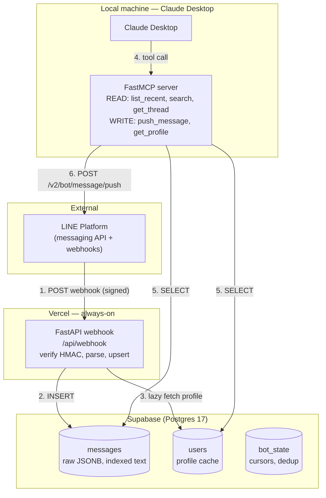

# Architecture

This document describes how a single LINE message travels from your friend's phone to a Claude response — and back.

---

## 1. Mental model

LINE delivers inbound messages by **pushing** them to your webhook. There is no API endpoint to fetch messages later. This forces a **decoupled** architecture:

| Concern | Component | Lifecycle |
|---|---|---|
| Capture (must run 24/7) | Vercel webhook + Supabase | Always on |
| Read (on-demand) | LINE-MCP server | Only while Claude Desktop is open |
| Send (on-demand) | LINE-MCP server → LINE Messaging API | Only while Claude Desktop is open |

The webhook is the only critical-uptime component. If it goes down, messages are lost. Vercel's serverless free tier handles this with no operational overhead.

---

## 2. System diagram



---

## 3. Full message lifecycle

The complete sequence — from sender to Claude's response — across both phases.

```mermaid
sequenceDiagram
    autonumber
    actor U as User
    participant App as LINE App
    participant LP as LINE Platform
    participant V as Vercel webhook
    participant DB as Supabase
    participant CD as Claude Desktop
    participant MCP as LINE-MCP
    participant API as Anthropic API
    participant LineAPI as LINE Messaging API

    rect rgb(20, 60, 40)
    Note over U,DB: PHASE 1 — CAPTURE (always running, no Claude)
    U->>App: type and send message
    App->>LP: HTTPS / TLS
    LP->>LP: assign messageId, sign payload
    LP->>V: POST /api/webhook + x-line-signature
    V->>V: verify HMAC-SHA256
    V->>DB: INSERT INTO messages
    DB-->>V: ok
    V-->>LP: 200 OK
    end

    rect rgb(50, 30, 60)
    Note over CD,LineAPI: PHASE 2 — READ + REPLY (on demand)
    U->>CD: "What's my latest LINE msg? Reply 'on my way'"
    CD->>API: prompt + tool definitions
    API-->>CD: tool_use list_recent_messages
    CD->>MCP: stdio: tool call
    MCP->>DB: SELECT ... ORDER BY ts DESC LIMIT 1
    DB-->>MCP: row
    MCP-->>CD: tool result
    CD->>API: history + result
    API-->>CD: tool_use push_message
    CD->>MCP: stdio: push_message
    MCP->>LineAPI: POST /v2/bot/message/push
    LineAPI-->>MCP: 200 OK
    MCP-->>CD: success
    CD->>API: history + result
    API-->>CD: final response
    CD-->>U: shows result
    LineAPI->>App: deliver "on my way"
    end
```



---

## 4. Data shape at each hop

### Hop 1 — LINE → Vercel webhook

```http
POST /api/webhook HTTP/1.1
Host: <your-app>.vercel.app
Content-Type: application/json
X-Line-Signature: <base64 HMAC-SHA256>

{
  "destination": "U_your_bot_id",
  "events": [{
    "type": "message",
    "webhookEventId": "01H8XK...",
    "deliveryContext": {"isRedelivery": false},
    "timestamp": 1746518400123,
    "source": {"type": "user", "userId": "U_friend_id"},
    "replyToken": "0fA1B2c3...",
    "message": {"id": "987654321", "type": "text", "text": "test message"}
  }]
}
```

### Hop 2 — Vercel → Supabase

```sql
INSERT INTO messages
  (message_id, source_type, source_id, sender_user_id,
   message_type, text_content, raw, line_timestamp)
VALUES
  ('987654321', 'user', 'U_friend_id', 'U_friend_id',
   'text', 'test message', '{...full event...}'::jsonb,
   to_timestamp(1746518400.123))
ON CONFLICT (message_id) DO NOTHING;
```

### Hop 3 — Vercel → LINE (response)

```http
HTTP/1.1 200 OK
```

LINE only checks the status code. Body is ignored. Return fast — heavy work blocks LINE's retry logic.

### Hop 4 — Claude Desktop ↔ MCP (JSON-RPC 2.0 over stdio)

```json
// Request
{"jsonrpc":"2.0","id":42,"method":"tools/call",
 "params":{"name":"list_recent_messages","arguments":{"limit":1}}}

// Response
{"jsonrpc":"2.0","id":42,"result":{
  "content":[{"type":"text","text":"[{...message json...}]"}]
}}
```

### Hop 5 — MCP → LINE Messaging API (sending)

```http
POST https://api.line.me/v2/bot/message/push HTTP/1.1
Authorization: Bearer <channel_access_token>
Content-Type: application/json

{"to": "U_friend_id", "messages": [{"type": "text", "text": "on my way"}]}
```

---

## 5. Trust boundaries

| Boundary | Mechanism | Failure if broken |
|---|---|---|
| LINE → Vercel | HMAC-SHA256 signature with channel secret | Anyone can POST fake events into your DB |
| Vercel → Supabase | TLS + service key in Vercel env vars | Leaked key = full DB access |
| Claude Desktop ↔ MCP | OS process boundary (stdio, same user) | Malicious local process could call MCP |
| MCP → LINE API | Channel access token (Bearer) | Leaked token = anyone can send as your bot |

The single most important control: **HMAC verification at the webhook**. If you skip it, your DB is a public dumping ground. See [`docs/SECURITY.md`](./docs/SECURITY.md).

---

## 6. Why this architecture

### Why Vercel for the webhook
- Free tier covers personal traffic forever.
- Always-on without a server to maintain.
- HTTPS, valid TLS cert, public URL — all required by LINE.

### Why Supabase for storage
- Free Postgres 17 with pgvector available for future semantic search.
- JSONB column lets us store the raw event for forward compatibility.
- Service key is the only secret the webhook needs.

### Why one MCP (not two)
- The official `@line/line-bot-mcp-server` is send-only.
- Reading and replying-in-context is the main UX win — splitting forces awkward coordination.
- Send tools are ~30 lines of code; not worth a second MCP.

### Why FastMCP (Python)
- Stack consistency with the webhook.
- Pydantic models reusable across both halves via `shared/`.
- Stdio transport works directly with Claude Desktop.

### Why `pushMessage`, not `replyMessage`
- LINE's `replyToken` expires in ~60 seconds and is single-use.
- An interactive Claude session can easily exceed that during reasoning.
- Push has no such restriction; the trade-off is the 200/month free-tier cap, which is fine for personal use.

---

## 7. What this architecture does not do

- **Does not read your personal LINE chats.** No public API exists.
- **Does not provide real-time streaming to Claude.** Claude sees what's in the DB at query time. If you need push notifications to Claude, that's a separate webhook + something like a desktop notification.
- **Does not retain unlimited history.** Supabase free tier is 500 MB — at ~1 KB per message, that's ~500K messages. Plenty for personal use, but plan for archival if scaling.
- **Does not handle multi-tenancy.** Single-user by design. Add a `tenant_id` column if you ever extend.
