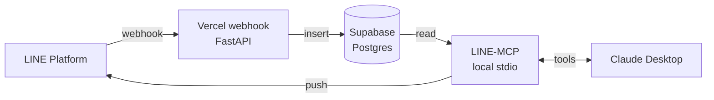
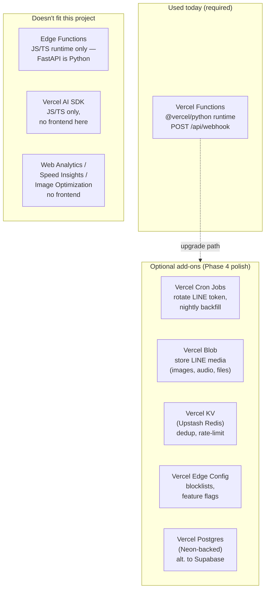
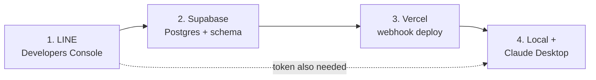
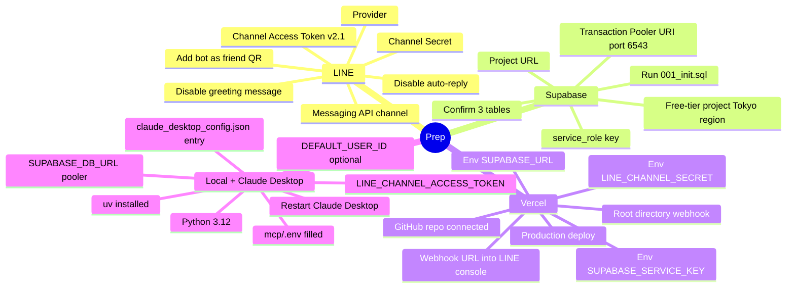
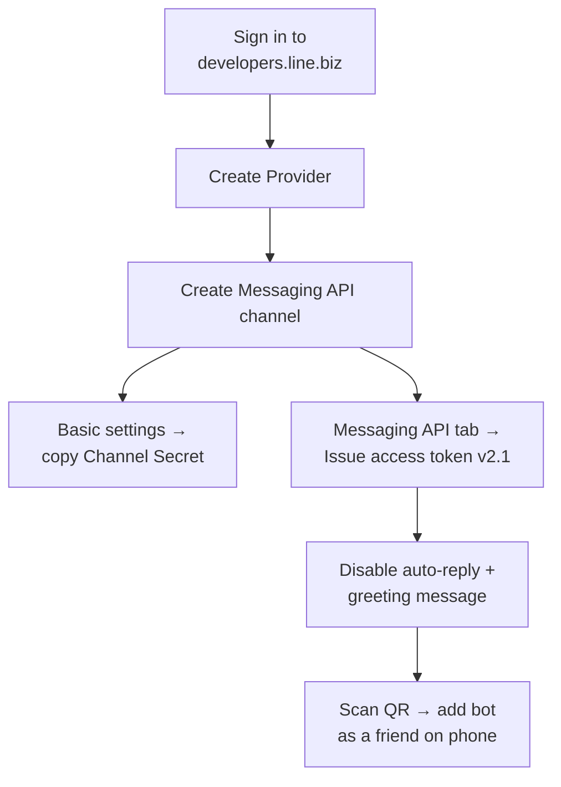
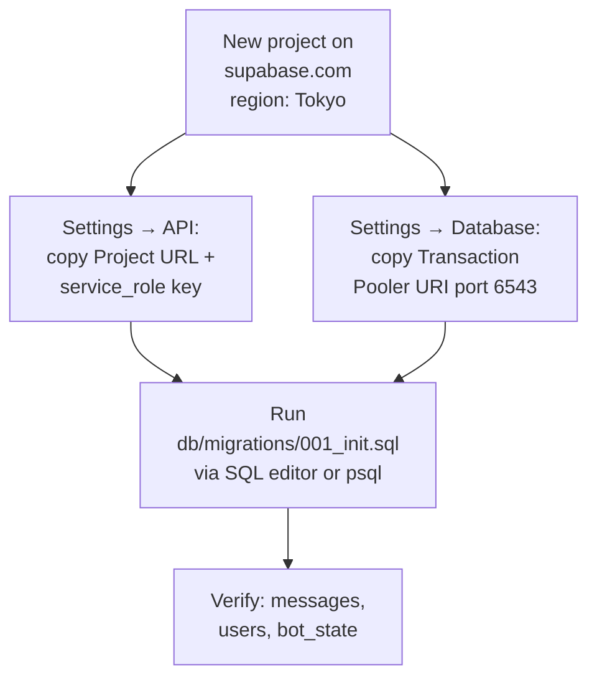
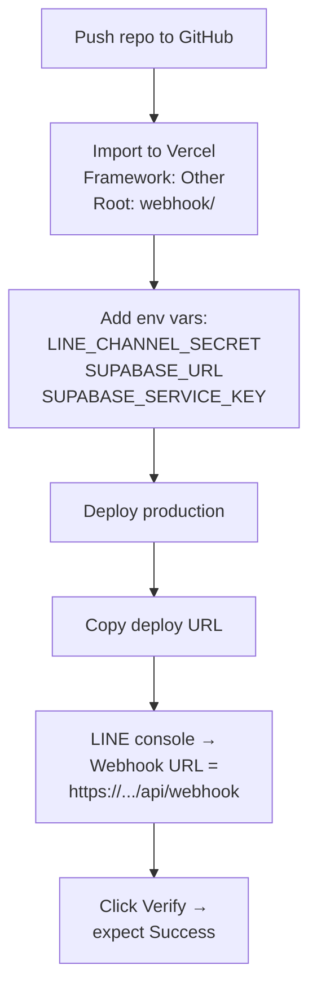
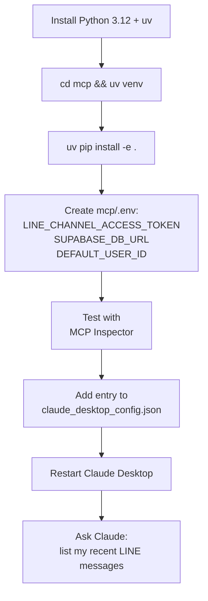

# LINE-MCP

> Personal LINE Official Account inbox, readable and replyable from Claude Desktop via MCP.

**What this is:** A two-component system that captures every message sent to your LINE bot, stores it in your own database, and exposes it to Claude Desktop through a Model Context Protocol (MCP) server. You can read your bot's inbox by chatting with Claude, and reply through the same conversation.

**What this is not:** A way to read your *personal* LINE chats. LINE has no public API for that. This works only with messages sent to a LINE Official Account (bot) you control.

---

## Quick start (working today)

The [`local/`](local/) directory is a self-contained Node implementation that is live now: Tailscale Funnel → local receiver → `inbox.jsonl` → MCP tools in Claude Code (read, ack, send, status) with an offline auto-reply. See [local/README.md](local/README.md) and [local/PLAYBOOK.md](local/PLAYBOOK.md) (current state, the Funnel-DNS failure, resume steps). The rest of this document describes the always-on Vercel + Supabase design.

## Architecture at a glance



**Two phases, decoupled:**

1. **Capture (always running):** LINE pushes inbound messages to a Vercel webhook → stored in Supabase. Happens 24/7 whether or not Claude is running.
2. **Read + reply (on demand):** Claude Desktop launches the MCP locally, which queries Supabase for reads and calls the LINE Messaging API for sends.

See [`ARCHITECTURE.md`](./ARCHITECTURE.md) for the full picture.

---

## Vercel ecosystem support

**Short answer: no — this project uses one slice of Vercel today (Functions / Python).** The rest of the Vercel ecosystem is either optional (good fits we haven't wired up) or out of scope (frontend-only or JS/TS-only).



### Category-by-category

| Vercel product            | Status      | Why / when to add                                                                                                  |
|---------------------------|-------------|--------------------------------------------------------------------------------------------------------------------|
| **Functions (Python)**    | required    | Hosts `webhook/api/webhook.py`. The only Vercel piece you must provision today.                                    |
| **Cron Jobs**             | optional    | Add when you want auto-rotation of the 30-day LINE access token, or scheduled SQL hygiene.                         |
| **Blob**                  | optional    | Add when you want to keep LINE-side media (images/audio/files) after LINE's ~14-day retention.                     |
| **KV (Upstash Redis)**    | optional    | Add for fast idempotency lookups or per-sender rate limits — DB `ON CONFLICT` covers the common case today.        |
| **Edge Config**           | optional    | Add for low-latency reads of blocklists / feature flags from the webhook hot path.                                 |
| **Postgres (Neon)**       | alternative | Use *instead of* Supabase if you'd rather stay 100% inside Vercel. You lose the Supabase dashboard + auth niceties. |
| **Edge Functions**        | not a fit   | Python isn't supported on Edge runtime.                                                                            |
| **AI SDK**                | not a fit   | JS/TS-only, and Claude Desktop is already the LLM client here.                                                     |
| **Web Analytics**         | not a fit   | No frontend page to instrument.                                                                                    |
| **Speed Insights**        | not a fit   | No frontend page to instrument.                                                                                    |
| **Image Optimization**    | not a fit   | No image URLs to serve.                                                                                            |
| **Marketplace: Supabase** | already in  | The Supabase integration is the database half — already part of the setup.                                         |

---

## What to prepare in each category

The system has four prep categories. Walk them in this order — each one unblocks the next.





### 1. LINE Developers Console

What you'll produce: **`LINE_CHANNEL_SECRET`** and **`LINE_CHANNEL_ACCESS_TOKEN`**.



- Copy **Channel Secret** → `LINE_CHANNEL_SECRET` (webhook env).
- Issue **Channel Access Token v2.1**, max 30-day expiry → `LINE_CHANNEL_ACCESS_TOKEN` (MCP env).
- Disable **auto-reply** and **greeting messages** so the bot stays silent until your code answers.
- Leave **Webhook URL** blank — you'll fill it after Vercel deploys.

### 2. Supabase (Postgres)

What you'll produce: **`SUPABASE_URL`**, **`SUPABASE_SERVICE_KEY`**, **`SUPABASE_DB_URL`**, and an applied schema.



- `SUPABASE_URL` + `SUPABASE_SERVICE_KEY` go into Vercel (webhook side).
- `SUPABASE_DB_URL` **must be the Transaction Pooler URI on port 6543** — direct port 5432 will exhaust connections. Goes into the local MCP `.env`.

### 3. Vercel (webhook host)

What you'll produce: a deployed webhook URL like `https://<project>.vercel.app/api/webhook`.



- Set **Root Directory** to `webhook` — the Python function lives in the subdirectory.
- Apply env vars to **Production**, **Preview**, and **Development**.
- After deploy, paste the URL into LINE Developers Console and click **Verify**.

#### Optional Vercel add-ons (Phase 4)

| Add-on              | When you need it                                  | What to prepare                                                                                       |
|---------------------|---------------------------------------------------|-------------------------------------------------------------------------------------------------------|
| **Cron Jobs**       | Auto-rotate the 30-day LINE access token          | Add a `crons` entry in `vercel.json`; create `api/rotate_token.py`; store rotation creds in env vars. |
| **Blob**            | Persist LINE-side media past ~14 days             | Enable Blob on the project; add `BLOB_READ_WRITE_TOKEN` env var; download via `/v2/bot/message/{id}/content` on demand. |
| **KV**              | Fast idempotency / per-sender rate limit          | Provision a KV store; add `KV_REST_API_URL` + `KV_REST_API_TOKEN`; replace the DB-only dedup if hot.   |
| **Edge Config**     | Low-latency blocklists or feature flags           | Create an Edge Config store; add the access token; read in `webhook.py` before the DB insert.         |
| **Postgres (Neon)** | Stay fully inside Vercel instead of Supabase      | Provision the integration; swap `SUPABASE_*` env vars for `POSTGRES_URL`; rerun `001_init.sql`.       |

### 4. Local machine + Claude Desktop (MCP)

What you'll produce: a running MCP process that Claude Desktop can call.



- `SUPABASE_DB_URL` here is the **same** pooler URI from step 2 — keep it port 6543.
- `DEFAULT_USER_ID` is optional; fill it in once you've sent yourself a test message and read `sender_user_id` from the `messages` table.
- The `command` in `claude_desktop_config.json` must point to an **absolute** `mcp/` path and use `uv run server.py`.

---

## One-click deploy (webhook half)

[](https://vercel.com/new/clone?repository-url=https%3A%2F%2Fgithub.com%2Fsantapong%2FKeepMessage&env=LINE_CHANNEL_SECRET,SUPABASE_URL,SUPABASE_SERVICE_KEY&envDescription=LINE%20channel%20secret%20%2B%20Supabase%20service-role%20credentials.%20See%20.env.example.&envLink=https%3A%2F%2Fgithub.com%2Fsantapong%2FKeepMessage%2Fblob%2Fmain%2F.env.example&project-name=line-mcp-webhook&repository-name=line-mcp-webhook&root-directory=webhook)

This button deploys the **capture** half only (`webhook/`). The MCP **read + reply** half runs locally on your machine — not deployable to Vercel by design.

Full walkthrough: [`SETUP.md`](./SETUP.md).

---

## Tech stack

| Layer | Choice |
|---|---|
| Webhook | Python 3.12 + FastAPI on Vercel (`@vercel/python`) |
| Database | Supabase (Postgres 17) |
| MCP | FastMCP (Python), stdio transport |
| LINE SDK | `line-bot-sdk` (webhook) + `httpx` (MCP) |

Cost for personal use: **$0/month**, indefinitely. See [`PROJECT-PLAN.md`](./PROJECT-PLAN.md#cost-analysis).

---

## Quickstart

```bash
# 1. Clone
git clone https://github.com/<you>/line-mcp.git
cd line-mcp

# 2. Provision external services (one-time)
#    Follow SETUP.md to create:
#    - LINE Developers channel (get CHANNEL_SECRET, CHANNEL_ACCESS_TOKEN)
#    - Supabase project (get SUPABASE_URL, SUPABASE_SERVICE_KEY)
#    - Vercel project linked to this repo

# 3. Apply database schema
psql $SUPABASE_DB_URL -f db/migrations/001_init.sql

# 4. Local env
cp .env.example .env
# fill in the values

# 5. Deploy webhook
vercel --prod

# 6. Set webhook URL in LINE Developers Console:
#    https://<your-vercel-app>.vercel.app/api/webhook

# 7. Run MCP locally + add to Claude Desktop config
#    See docs/DEPLOYMENT.md
```

---

## Documentation

| Doc | Purpose |
|---|---|
| [`ARCHITECTURE.md`](./ARCHITECTURE.md) | Full system picture, sequence diagrams, trust boundaries |
| [`PROJECT-PLAN.md`](./PROJECT-PLAN.md) | Phased build plan, deliverables, exit criteria, risks |
| [`SETUP.md`](./SETUP.md) | Step-by-step external service setup |
| [`docs/DATA-MODEL.md`](./docs/DATA-MODEL.md) | Schema design and rationale |
| [`docs/MCP-TOOLS.md`](./docs/MCP-TOOLS.md) | MCP tool specifications |
| [`docs/SECURITY.md`](./docs/SECURITY.md) | HMAC verification, secrets, threat model |
| [`docs/DEPLOYMENT.md`](./docs/DEPLOYMENT.md) | Vercel + Supabase + Claude Desktop wiring |

---

## Repo layout

```
line-mcp/
├── webhook/                  # Deployed to Vercel
│   ├── api/webhook.py        # POST /api/webhook handler
│   ├── lib/                  # signature verify, parsing, DB
│   ├── requirements.txt
│   └── vercel.json
├── mcp/                      # Runs locally via Claude Desktop
│   ├── server.py             # FastMCP entrypoint
│   ├── tools/                # read + send tool implementations
│   ├── lib/                  # LINE client, DB pool
│   └── pyproject.toml
├── shared/                   # Pydantic models reused both sides
├── db/migrations/            # Schema SQL
├── docs/                     # All documentation
└── .env.example
```

---

## Status

**Pre-alpha.** This scaffold is the design; implementation lives in the phased plan.

## License

MIT — see [`LICENSE`](./LICENSE).
