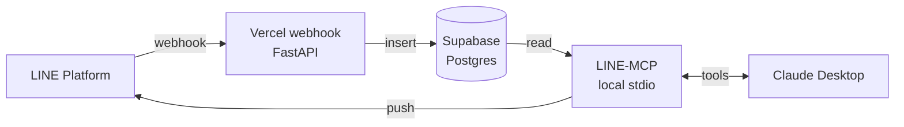

# LINE-MCP

> Personal LINE Official Account inbox, readable and replyable from Claude Desktop via MCP.

**What this is:** A two-component system that captures every message sent to your LINE bot, stores it in your own database, and exposes it to Claude Desktop through a Model Context Protocol (MCP) server. You can read your bot's inbox by chatting with Claude, and reply through the same conversation.

**What this is not:** A way to read your *personal* LINE chats. LINE has no public API for that. This works only with messages sent to a LINE Official Account (bot) you control.

---

## Architecture at a glance



**Two phases, decoupled:**

1. **Capture (always running):** LINE pushes inbound messages to a Vercel webhook → stored in Supabase. Happens 24/7 whether or not Claude is running.
2. **Read + reply (on demand):** Claude Desktop launches the MCP locally, which queries Supabase for reads and calls the LINE Messaging API for sends.

See [`ARCHITECTURE.md`](./ARCHITECTURE.md) for the full picture.

---

## One-click deploy (webhook half)

[](https://vercel.com/new/clone?repository-url=https%3A%2F%2Fgithub.com%2Fsantapong%2FKeepMessage&env=LINE_CHANNEL_SECRET,SUPABASE_URL,SUPABASE_SERVICE_KEY&envDescription=LINE%20channel%20secret%20%2B%20Supabase%20service-role%20credentials.%20See%20.env.example.&envLink=https%3A%2F%2Fgithub.com%2Fsantapong%2FKeepMessage%2Fblob%2Fmain%2F.env.example&project-name=line-mcp-webhook&repository-name=line-mcp-webhook&root-directory=webhook)

This button deploys the **capture** half only (`webhook/`). The MCP **read + reply** half runs locally on your machine — not deployable to Vercel by design.

**Before clicking, have these ready:**

1. **LINE Official Account** — from [LINE Developers Console](https://developers.line.biz/console/), create a Provider + Messaging API channel and copy:
   - `LINE_CHANNEL_SECRET` (Channel → Basic settings)
   - `LINE_CHANNEL_ACCESS_TOKEN` (Channel → Messaging API tab) — not needed for the webhook deploy, but you'll need it for the MCP step.
2. **Supabase project** — from [supabase.com](https://supabase.com), create a project and copy:
   - `SUPABASE_URL` (Settings → API)
   - `SUPABASE_SERVICE_KEY` (Settings → API → `service_role` key — keep secret)
   - `SUPABASE_DB_URL` (Settings → Database → **Transaction Pooler URI, port 6543**) — for the MCP step.
3. **Run the schema** against Supabase before sending traffic:
   ```bash
   psql "$SUPABASE_DB_URL" -f db/migrations/001_init.sql
   ```

**After Vercel finishes deploying:**

1. Copy the deployment URL, e.g. `https://line-mcp-webhook-xxx.vercel.app`.
2. In LINE Developers Console → your channel → Messaging API → **Webhook URL**, set:
   `https://<your-vercel-app>.vercel.app/api/webhook`
3. Click **Verify** in the LINE console — should return `Success`.
4. Enable **Use webhook**, disable **Auto-reply messages** and **Greeting messages**.
5. Add the bot as a friend on your phone (QR code in the console) and DM it. Check the `messages` table in Supabase — the row should land within ~2s.

Full walkthrough: [`SETUP.md`](./SETUP.md).

---

## Tech stack

| Layer | Choice |
|---|---|
| Webhook | Python 3.12 + FastAPI on Vercel (`@vercel/python`) |
| Database | Supabase (Postgres 17) |
| MCP | FastMCP (Python), stdio transport |
| LINE SDK | `line-bot-sdk` (webhook) + `httpx` (MCP) |

Cost for personal use: **$0/month**, indefinitely. See [`PROJECT-PLAN.md`](./PROJECT-PLAN.md#cost-analysis).

---

## Quickstart

```bash
# 1. Clone
git clone https://github.com/<you>/line-mcp.git
cd line-mcp

# 2. Provision external services (one-time)
#    Follow SETUP.md to create:
#    - LINE Developers channel (get CHANNEL_SECRET, CHANNEL_ACCESS_TOKEN)
#    - Supabase project (get SUPABASE_URL, SUPABASE_SERVICE_KEY)
#    - Vercel project linked to this repo

# 3. Apply database schema
psql $SUPABASE_DB_URL -f db/migrations/001_init.sql

# 4. Local env
cp .env.example .env
# fill in the values

# 5. Deploy webhook
vercel --prod

# 6. Set webhook URL in LINE Developers Console:
#    https://<your-vercel-app>.vercel.app/api/webhook

# 7. Run MCP locally + add to Claude Desktop config
#    See docs/DEPLOYMENT.md
```

---

## Documentation

| Doc | Purpose |
|---|---|
| [`ARCHITECTURE.md`](./ARCHITECTURE.md) | Full system picture, sequence diagrams, trust boundaries |
| [`PROJECT-PLAN.md`](./PROJECT-PLAN.md) | Phased build plan, deliverables, exit criteria, risks |
| [`SETUP.md`](./SETUP.md) | Step-by-step external service setup |
| [`docs/DATA-MODEL.md`](./docs/DATA-MODEL.md) | Schema design and rationale |
| [`docs/MCP-TOOLS.md`](./docs/MCP-TOOLS.md) | MCP tool specifications |
| [`docs/SECURITY.md`](./docs/SECURITY.md) | HMAC verification, secrets, threat model |
| [`docs/DEPLOYMENT.md`](./docs/DEPLOYMENT.md) | Vercel + Supabase + Claude Desktop wiring |

---

## Repo layout

```
line-mcp/
├── webhook/                  # Deployed to Vercel
│   ├── api/webhook.py        # POST /api/webhook handler
│   ├── lib/                  # signature verify, parsing, DB
│   ├── requirements.txt
│   └── vercel.json
├── mcp/                      # Runs locally via Claude Desktop
│   ├── server.py             # FastMCP entrypoint
│   ├── tools/                # read + send tool implementations
│   ├── lib/                  # LINE client, DB pool
│   └── pyproject.toml
├── shared/                   # Pydantic models reused both sides
├── db/migrations/            # Schema SQL
├── docs/                     # All documentation
└── .env.example
```

---

## Status

🚧 **Pre-alpha.** This scaffold is the design; implementation lives in the phased plan.

## License

MIT — see [`LICENSE`](./LICENSE).
