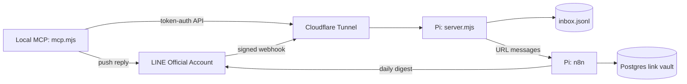

# KeepMessage

KeepMessage is a private LINE Official Account inbox that can be read and
replied to through MCP. The production receiver runs continuously on a
Raspberry Pi; the local MCP client reaches it through an authenticated API.

It cannot read personal LINE chats. It receives only messages sent to a LINE
Official Account you control.

## Status

**Maintained — v1.0.0.** The Pi receiver, Cloudflare Tunnel, remote
MCP access, offline reply, and link-vault forwarding are live. On 2026-09-05,
the public health endpoint returned 200, the inbox rejected an unauthenticated
request with 401, the local receiver auth/signature paths passed, and the Node
dependency audit reported zero vulnerabilities.

Canonical repository: <https://github.com/santapong/KeepMessage>. Former
`Line-MCP` and lowercase `keepmessage` URLs resolve to this repository.
`line-inbox-mcp` is not a separate live repository.

## Live architecture



The Python/Vercel/Supabase implementation remains in `webhook/`, `mcp/`, and
`db/` as a reference design. It is not the production path and has no active
delivery commitment.

## Runtime components

| Path | Responsibility |
|---|---|
| `local/server.mjs` | Verify LINE HMAC signatures, deduplicate events, append the inbox, provide authenticated read/ack/heartbeat endpoints, send offline replies, and forward URL messages to n8n. |
| `local/mcp.mjs` | Expose receive, acknowledge, status, and send tools; maintain the online heartbeat through the remote API. |
| `local/PLAYBOOK.md` | Deployment, recovery, tunnel, n8n, and link-vault runbook. |
| `webhook/`, `mcp/`, `db/` | Superseded hosted design retained for reference. |

## Local verification

```bash
cd local
npm ci
npm audit --omit=dev
node --check server.mjs
node --check mcp.mjs
```

Copy `local/line-inbox.env.example` to `local/line-inbox.env` and fill values
outside Git. Never commit inbox data, credentials, local notes, or tunnel
material. See [local/README.md](local/README.md) for component setup and
[local/PLAYBOOK.md](local/PLAYBOOK.md) for the live deployment.

## Data and security boundary

- The Pi's `local/inbox.jsonl` is the authoritative message inbox.
- Link-vault URLs and status live in the Pi's Postgres service.
- LINE messages and identifiers are private data and must not enter fixtures,
  screenshots, issues, or logs shared outside the operator's environment.
- Remote inbox endpoints require `x-api-token`; LINE webhooks require a valid
  raw-body signature. `/health` intentionally contains no private state.
- Repository history cannot restore runtime data. Backup and recovery are
  documented in [MAINTENANCE.md](MAINTENANCE.md).

## Bounded scope

Maintain the existing personal workflow. New dashboards, semantic search,
media archiving, multi-user support, and hosted-database migration stay parked
unless a real incident or repeated usage need justifies them.

## Documentation

- [MAINTENANCE.md](MAINTENANCE.md) — ownership, state, checks, and recovery.
- [CHANGELOG.md](CHANGELOG.md) — current maintained release.
- [ARCHITECTURE.md](ARCHITECTURE.md) — original hosted design.
- [PROJECT-PLAN.md](PROJECT-PLAN.md) — historical plan, now superseded.
- [docs/SECURITY.md](docs/SECURITY.md) — threat model reference.

## License

MIT — see [LICENSE](LICENSE).
