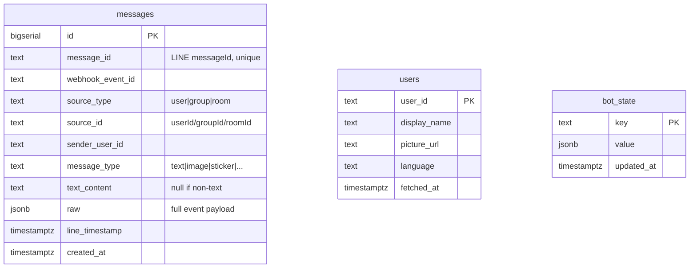

# Data Model

## Schema overview

Three tables. That's it. Resist the urge to add more until you actually need them.



---

## Table: `messages`

Every webhook event with `type=message` produces one row.

| Column | Purpose |
|---|---|
| `id` | Internal sequential ID, useful for ordering/cursoring |
| `message_id` | LINE's message ID — `UNIQUE` for idempotency on webhook retries |
| `webhook_event_id` | LINE's event-level ID — useful for debugging |
| `source_type` | `'user'`, `'group'`, or `'room'`. Determines who sent it |
| `source_id` | The conversation identifier — userId, groupId, or roomId |
| `sender_user_id` | The actual sender. In groups, differs from `source_id` |
| `message_type` | `'text'`, `'image'`, `'sticker'`, `'audio'`, `'video'`, `'file'`, `'location'` |
| `text_content` | The text, if `message_type='text'`. NULL otherwise |
| `raw` | The full event JSON — forward compatibility, replay, debugging |
| `line_timestamp` | LINE's authoritative timestamp |
| `created_at` | When *we* inserted (for diagnosing webhook delays) |

### Key design decisions

**Why `raw jsonb`?**
- LINE's event schema evolves. Stickers, locations, quoted messages, flex carousels — adding fields later means re-collecting data you can't get back. Storing raw is a one-line cost for forever-flexibility.
- Costs ~1 KB per row. Supabase free tier has 500 MB. You'd hit limits at ~500K rows. Years away for personal use.

**Why `message_id UNIQUE`?**
- LINE retries webhooks on 5xx responses. Without uniqueness you'd get duplicate rows.
- Combined with `ON CONFLICT (message_id) DO NOTHING` in inserts, retries are free.

**Why no separate `text` field at the top level (instead of nested in raw)?**
- Tradeoff: we duplicate the text. Worth it because:
  - Indexable for full-text search via `to_tsvector`.
  - Faster queries (no JSON unpacking).
  - Most reads only need the text.
- The `raw` column is the source of truth. `text_content` is denormalized cache.

**Why no `tenant_id`?**
- Single-user by design. Adding a column "just in case" is bureaucratic ceremony.
- If you ever multi-tenant this, one migration adds the column. Cheap.

### Indexes

```sql
create index messages_source_time on messages (source_id, line_timestamp desc);
create index messages_time on messages (line_timestamp desc);
create index messages_text_fts on messages using gin (to_tsvector('simple', text_content));
```

| Index | Used by |
|---|---|
| `messages_source_time` | `get_conversation(source_id, limit)` |
| `messages_time` | `list_recent_messages(limit, since)` |
| `messages_text_fts` | `search_messages(query)` |

---

## Table: `users`

Profile cache. LINE's `/v2/bot/profile/{userId}` has rate limits and adds latency. Cache it.

| Column | Purpose |
|---|---|
| `user_id` | LINE userId (e.g., `U_abc123...`) |
| `display_name` | LINE display name at last fetch |
| `picture_url` | Avatar URL |
| `language` | User's locale |
| `fetched_at` | When we last fetched. Refresh if older than ~24h |

### When to populate

- **Lazy**, not eager. The webhook should NOT fetch profiles — that's an extra API call on the critical path.
- The MCP fetches profile on first read. Caches in this table. Subsequent reads hit the cache.

---

## Table: `bot_state`

Generic key-value JSONB store for things that don't deserve their own table.

| Use case | Key | Value |
|---|---|---|
| Last token rotation | `last_token_rotation` | `{"at": "2026-05-01T..."}` |
| Token expiry tracking | `token_expires_at` | `{"at": "2026-06-01T..."}` |
| Webhook health check | `last_event_at` | `{"at": "2026-05-06T..."}` |

Don't abuse this. If you find yourself stuffing structured data here, make a real table.

---

## Common queries

### Last 10 messages overall

```sql
select id, source_id, sender_user_id, text_content, line_timestamp
from messages
order by line_timestamp desc
limit 10;
```

### Conversation with one user

```sql
select text_content, line_timestamp
from messages
where source_id = 'U_friend_id'
order by line_timestamp desc
limit 50;
```

### Full-text search

```sql
select id, text_content, line_timestamp
from messages
where to_tsvector('simple', text_content) @@ plainto_tsquery('simple', 'meeting friday')
order by line_timestamp desc
limit 20;
```

### Messages in last 24 hours

```sql
select count(*), source_id
from messages
where line_timestamp > now() - interval '24 hours'
group by source_id
order by count(*) desc;
```

### Find a specific event by raw JSON

```sql
select id, raw
from messages
where raw -> 'message' ->> 'type' = 'sticker';
```

---

## Future extensions (Phase 4+)

- **Embeddings:** add `embedding vector(384)` column, use pgvector for semantic search. Local model (e.g., `all-MiniLM-L6-v2`) keeps cost at $0.
- **Reactions:** webhooks can include reaction events. Add a `reactions` table or just store in `raw`.
- **Threads:** LINE doesn't have native threads, but you can derive them from quoted-message references in `raw.message.quotedMessageId`.
